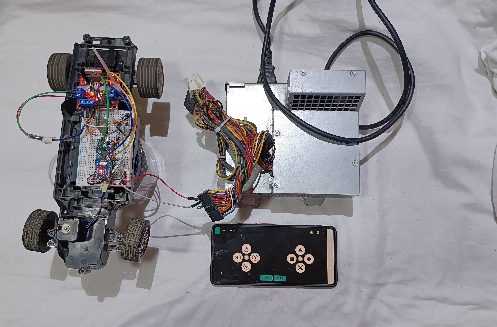
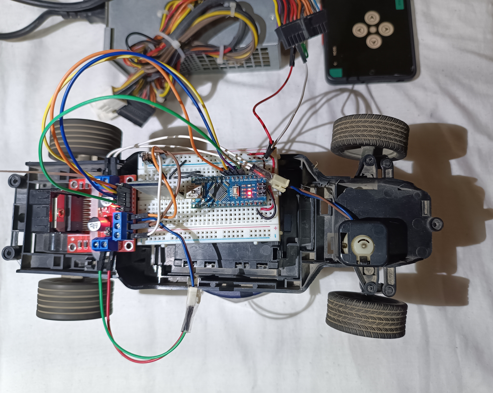
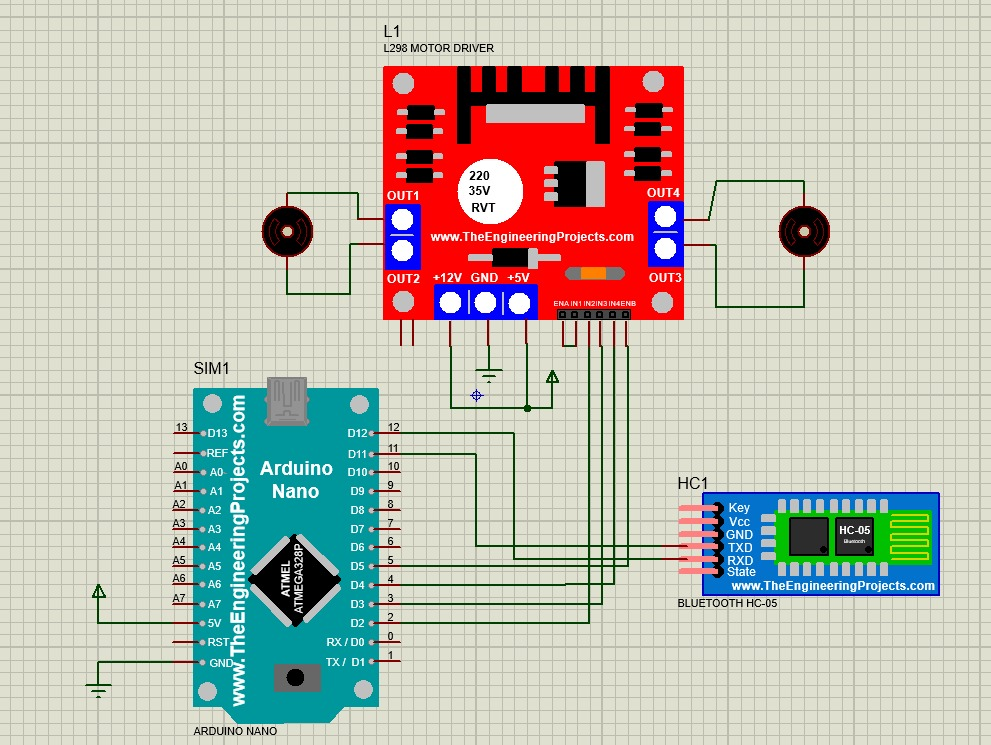

# Bluetooth-Controlled Robotic Car | Arduino Nano

An embedded control application developed in C for an autonomous/remote vehicle layout. The project utilizes an Arduino Nano interacting with an HC-05 Bluetooth module to process wireless incoming packets and command an L298N dual H-bridge motor driver for real-time navigation.

---

## 🛠️ Hardware Components

* **1x** Arduino Nano (ATmega328P)
* **1x** HC-05 Bluetooth Module
* **1x** L298N Motor Driver Module (Dual H-Bridge)
* **2x** 5V-12V DC Motors (Chassis Wheels)
* **1x** External Power Source (Battery Pack connected to Driver and Arduino)
* Dupont jumper wires & robotic car chassis

---

## 📐 Circuit & Schematic Layout

Below are the physical setup and the schematic routing diagrams. Both images are aligned horizontally to optimize readability:

  
  

  

---

## 💻 Software Logic & Embedded Architecture

The firmware is structured in native **C/C++** exploiting sequential communication and explicit hardware isolation:

* **Wireless Data Parsing:** Utilizes the `SoftwareSerial` library to open a dedicated virtual UART bus on pins `D11` and `D12`, preventing interference with the native hardware serial port (`D0`/`D1`).
* **Command Processing:** Implements a strict `switch-case` state evaluation routine to read incoming char packets (`F`, `B`, `L`, `R`, `S`) with minimal latency.
* **Actuator Phase Control:** Controls logic pins (`IN1` through `IN4`) to manipulate the dual H-Bridge internal polarities, allowing forward, reverse, and differential steering configurations.

---

## ⚙️ Interface & Pin Mapping Reference

### Bluetooth Module (HC-05)
| HC-05 Pin | Arduino Nano Pin | Description |
|---|---|---|
| `TXD` | `D11 (RX)` | Software Serial Receive Data Line |
| `RXD` | `D12 (TX)` | Software Serial Transmit Data Line |

### Motor Driver Control (L298N)
| Driver Logic Pin | Arduino Nano Pin | Vehicle Direction Control Function |
|---|---|---|
| `IN1` | `D2` | Motor Left - Forward Stage |
| `IN2` | `D3` | Motor Left - Reverse Stage |
| `IN3` | `D4` | Motor Right - Forward Stage |
| `IN4` | `D5` | Motor Right - Reverse Stage |

### Command Dataset
* **`F`**: Move Forward (`IN1=HIGH`, `IN3=HIGH`)
* **`B`**: Move Backward (`IN2=HIGH`, `IN4=HIGH`)
* **`L`**: Turn Left (Differential steering: Left Reverse, Right Forward)
* **`R`**: Turn Right (Differential steering: Left Forward, Right Reverse)
* **`S`**: Stop/Brake (All Control logic lines pulled to `LOW`)
